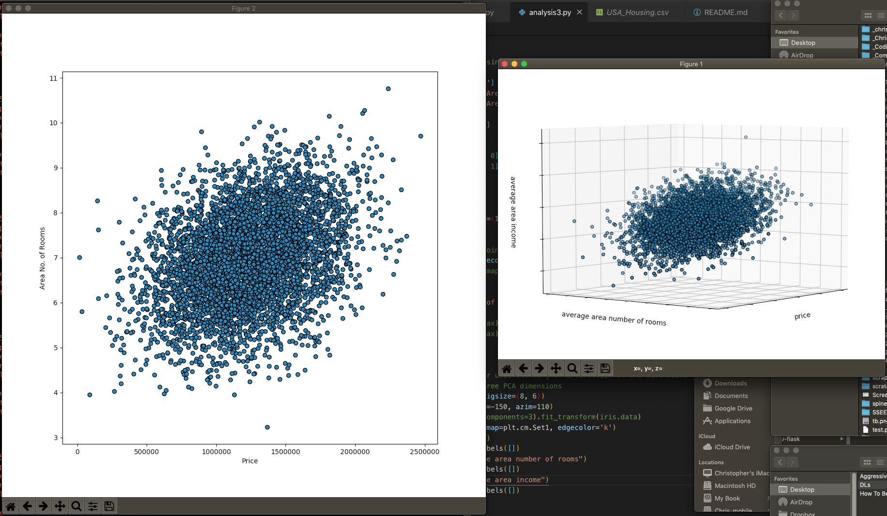

# petals, python, bokeh, matplotlib
--some python and data science learning



## Generate X Y Plot with borrowed regression data
```
$ python analysis.py
```

## Generate 3D Plot with iris data
```
$ python analysis2.py
```

## Generate XY and 3D Plot with USA Housing data
```
$ python analysis3.py
```